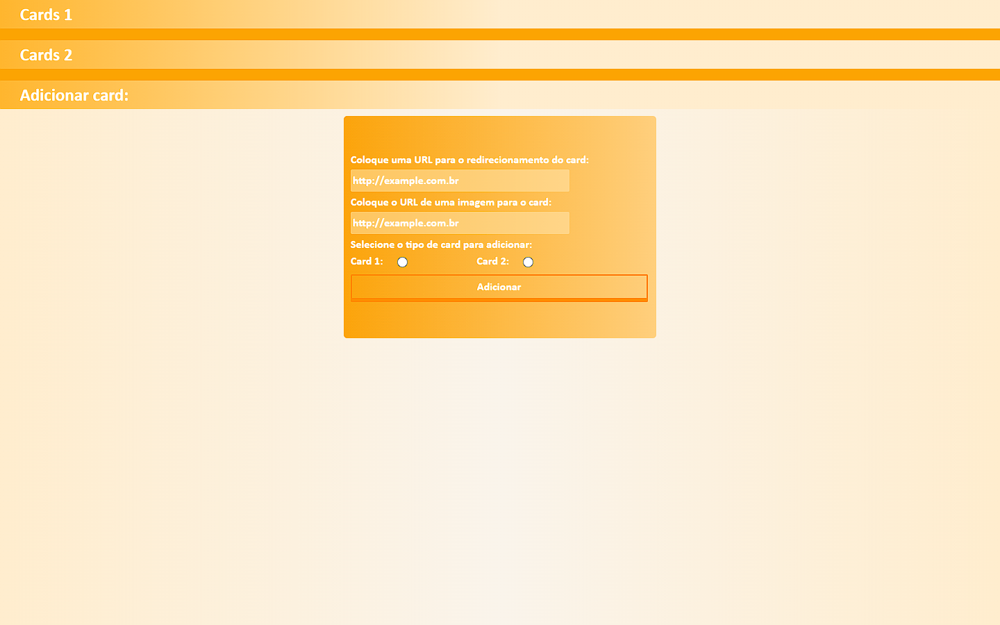
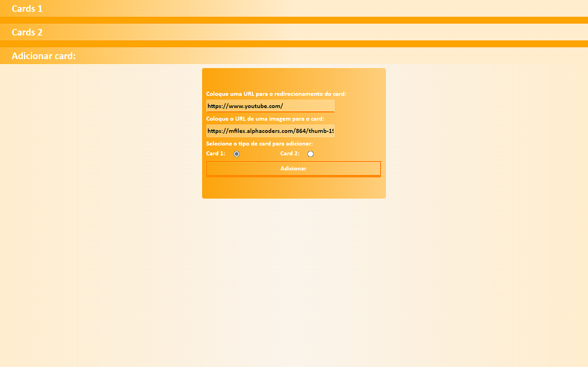
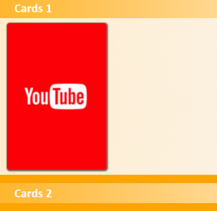
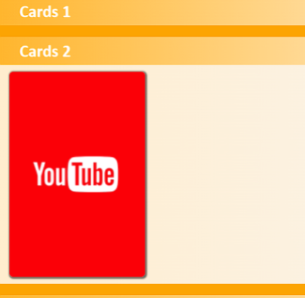

<h1>Cards(sem Banco de dados SQL)</h1>

<h2>O que faz:</h2>

O  usuário poderá adicionar ou remover cards no seu site, que servirão para redirecionar o usuário a alguma outra pagina ou site.

<h2>Como usar:</h2>

Basta colocar o link da imagem para capa do card, o link da URL que será para onde o card vai redirecionar ao clicar em no botão Ver, e escolher algumas das duas opções ali. Você também poderá apagar o card ao clicar no botão X. os Botões Ver e X aparecem ao passar o mouse sobre o card

O card será adicionado em Card 1 ou Card 2, dependendo da opção que você escolher.

<h2>Linguagens usadas:</h2>

  
  
  

<h2>Projeto desenvolvido por mim, <a href="https://github.com/breno05s">Breno Lourenço</a></h2>